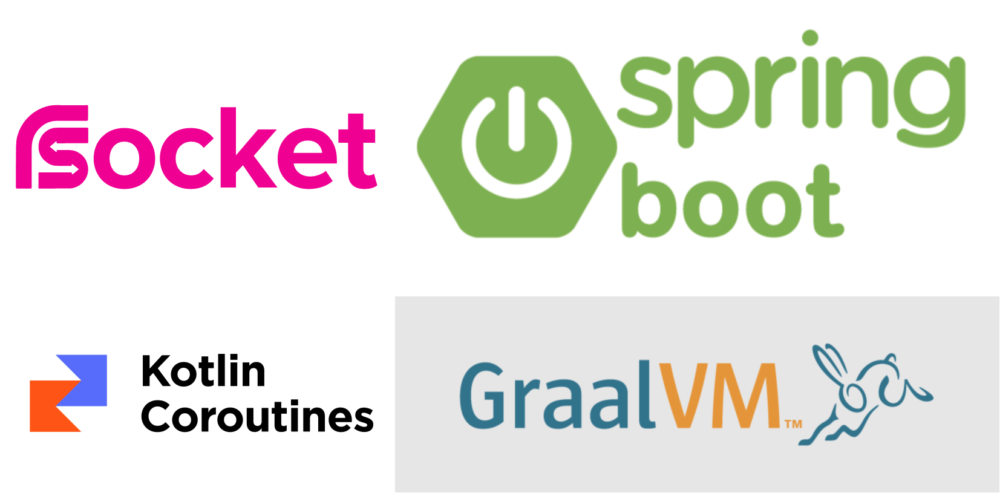
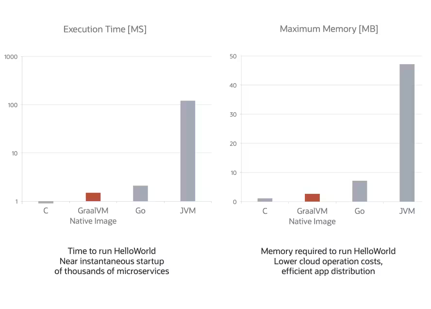
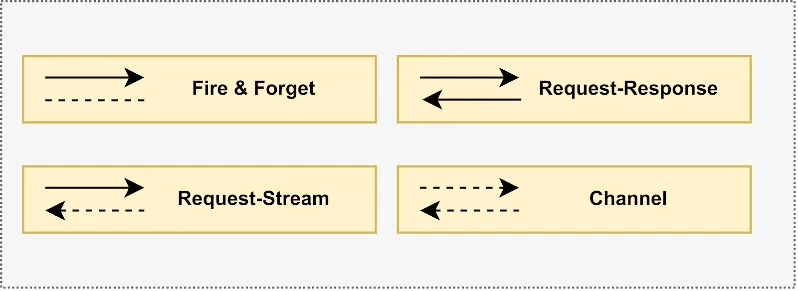
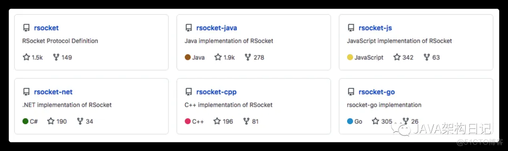

# 1 简介

[后端](https://github.com/yuri-li/native/tree/main/springboot-rsocket-kotlin-graalvm)，使用`springboot + rsocket + kotlin coroutines + graalvm`实现了响应式架构。

[前端](https://github.com/yuri-li/native/tree/main/vue3-rsocket-app)，使用`vue3 + rsocket-js`访问了后端接口。且，模仿`axios`封装了rsocket请求。

graalVM可以让整个项目更容易部署，启动速度更快，运行时占用更少的内存。而云服务是按需收费的，所以，探索这套技术栈很有必要。

# 2 为什么使用RSocket？

RSocket开放的接口不是Restful API，而且，测试困难，不支持Swagger

## 2.1 什么是响应式编程？

**响应式编程，从前端到后端，一直到数据库，没有一个节点是阻塞的。**

>  "spring webflux"根本不可能实现这个目标。

### 2.1.1 响应式架构的链路

- 前后端交互使用RSocket协议

- 后端微服务之间使用RSocket协议
  
  RSocket协议底层使用的websocket协议，所以，部署的服务是websocket集群

- 函数调用使用kotlin coroutines
  
  将异步回调转为顺序代码，在几乎不更改开发习惯的基础上，实现异步编程。底层原理较复杂，但，看起来跟“顺序代码”差不多

- 访问数据库使用R2dbc协议

### 2.1.2 什么是阻塞？

以“查询订单”为例。设，每个节点执行正常业务逻辑耗时1秒，且忽略网络交互的时间。

service等待dao的执行结果，所以service等待1秒，dao不需要等待；

同理controller需要等待service的执行结果，所以controller等待2秒。依次类推：

| 节点         | 执行  | 等待             | 响应时间 |
| ---------- | --- | -------------- | ---- |
| app/网页     | 1   | <mark>3</mark> | 4    |
| controller | 1   | <mark>2</mark> | 3    |
| service    | 1   | <mark>1</mark> | 2    |
| dao        | 1   | 0              | 1    |

其中，"等待"就是**阻塞**

### 2.1.3 Q&A

**1. 使用响应式架构后，app还需要等待3秒吗？**

答：是的，需要（执行1秒，等待3秒）

**2. 使用响应式架构后，app的响应时间是多少？**

答：4秒，执行1秒，等待3秒

**3. 有什么区别？**

答：使用响应式架构，等待的3秒，没有消耗资源

**4. QPS提高了多少？**

答：app的响应时间虽然还是4秒，但，只占用了1秒的资源。如果占用相同的资源，即4秒的资源，响应式架构的app可以同时运行4个请求，即，性能提高了4倍。

但，不能只考虑app一个节点。整个链路提高的性能是几何级增长的。即，整个链路提升的性能为`4*3*2*1 = 24`倍

**5. 调度不消耗资源吗？**

答：RSocket协议、kotlin coroutines等对“调度”的侧重点不同。核心原理，是通过顶层设计，去掉业务开发代码中的“资源调度”，交由框架处理，从而，彻底解决“阻塞”问题。

**6. 怎么测试？**

答：写测试用例，主要是功能测试。

解决“阻塞”问题的开发模型，可以简单理解为“发布订阅模型”，代码不是按编写顺序执行的。

比如，产品经理给开发人员布置任务的顺序，不代表开发人员完成任务的顺序。所谓的“顺序代码”与“异步编程”就是这个意思。

我们的代码看起来是“顺序代码”，实际是“异步执行”的。所以，测试时必须充分考虑业务场景，从性能、异步的角度考虑。已经不是点一下按钮等结果那么简单了，必须写测试代码。

所以，写测试用例，而不是在Swagger中点一点。

**7. 前端怎么验证接口？**

答：看后端的源码。前端只需要学习kotlin语法即可，可以看懂接口。

简单的接口，执行后端开发写好的测试用例，即可确认是否可用。

而且，RSocket接口支持多种语言，前端也可以自己写接口测试。

## 2.2 RSocket协议

通信协议事实上的标准是HTTP，它只支持请求/响应（Request-Response）的交互模式。不同的语言将使用不同的方法来解决这个问题，这需要团队之间的额外协调。以下协议，选择任何一种，意味着整个前后端的链路都要支持，任何一个环节有问题，都会中断项目。

- XMPP（Extensible Messaging and Presence Protocol）是一种开放式的XML协议，可以用于实现即时通讯、VoIP、在线游戏等应用。它具有很好的可扩展性和互操作性，可以支持多种客户端和服务器端实现，比较适合企业内部通讯或开放式社交网络等应用场景。

- MQTT（Message Queuing Telemetry Transport）是一种轻量级的发布-订阅消息传输协议，适用于低带宽、高延迟的网络环境，比较适合物联网、智能家居等场景。

- WebSocket是一种HTML5提供的双向通信协议，可以实现基于浏览器的即时通讯应用，比如在线聊天、视频会议等。

除了以上几种协议，还有一些专门的即时通讯协议，比如WhatsApp使用的Signal协议、微信使用的微信协议等，这些协议都有其独特的设计和优势。

### 2.2.1 痛点

比如，推送通知。可选的协议：MQTT、WebSocket、http轮询。其中，MQTT、WebSocket对开发人员要求较高，而http轮询的代码到处都是。

- 轮询，每秒都要执行大量请求，然后被告知没有“新消息”

- 每次请求客户端、服务器、网络都在花钱

- 无效请求占用了资源，为了提高可用性，必须增加基础设施、扩充运维团队

- 为了降低成本，轮询会使用更长的间隔，反而让用户接收通知不及时

### 2.2.2 RSocket协议

RSocket协议可以简单地看作http+websocket，提供如下4种交互模式：

- 在线聊天，使用`Channel`交互模式

- 推送通知，使用`Request-Stream`交互模式

而且，RSocket支持多种主流开发语言。

## 2.3 优势

RSocket协议的应用场景很全面，一旦打通全栈链路，意味着团队可以甩掉很重的技术包袱。而且，前后端统一的开发模式，更加高效。

# 3 为什么不选择spring webflux？

类似的问题，还有spring native、graphQL等。

Restful API（spring webflux）只支持http协议。云服务是按需收费的，性能，就是钱。综合考虑，优先支持“RSocket”，并在此基础上打通整个链路。
