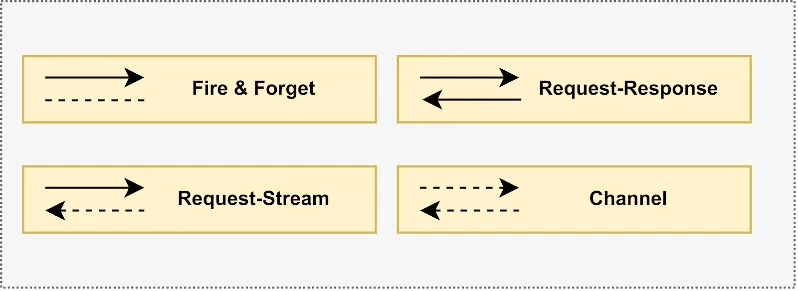
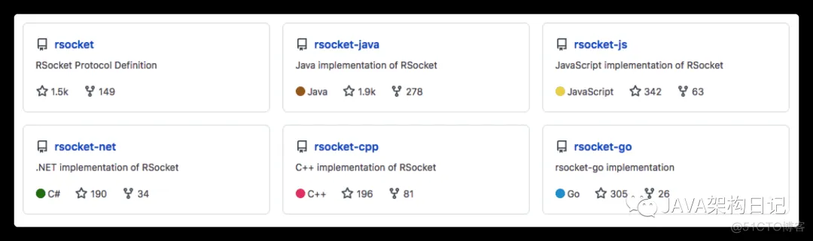
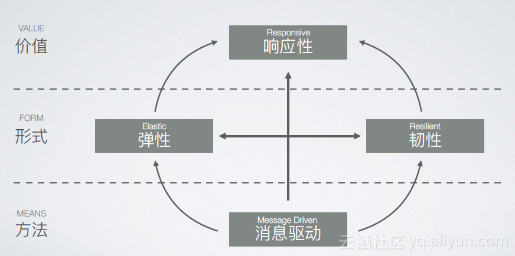

# 1 痛点

通信协议事实上的标准是HTTP，它只支持请求/响应（Request-Response）的交互模式。

假设要做在线聊天，选择哪种即时通讯协议？

> XMPP？MQTT？WebSocket？
> 
> WhatsApp使用的Signal协议、微信使用的微信协议。

选择任何一种协议，意味着整个前后端的链路都要支持。技术团队有一个岗位搞不定，项目就得无限延期。

这个例子不是很痛哈，换个例子，**推送通知**。

可选的协议：MQTT、WebSocket、http轮询。

大部分团队都会选http轮询，因为代码到处都是嘛，没什么风险。是吗？

- 轮询，每秒都要执行大量请求，然后被告知没有“新消息”

- 每次请求客户端、服务器、网络都在花钱

- 无效请求占用了资源，为了提高可用性，必须增加基础设施、扩充运维团队

- 为了降低成本，轮询会使用更长的间隔，反而让用户接收通知不及时

# 2 RSocket协议

## 2.1 交互模式

RSocket协议提供如下4种交互模式：

- 在线聊天，使用`Channel`交互模式

- 推送通知，使用`Request-Stream`交互模式

## 2.2 已实现的语言

RSocket支持多种主流开发语言

## 2.3 响应式宣言

这是指导思想。如果有精力，可以仔细研究。我也是按照这套思想做的技术选型。RSocket协议，目前是最好的。

# 3 为什么不选择XXX?

RSocket协议的应用场景很全面，团队可以甩掉很重的技术包袱。这些XXX，哪一个没有一套思想、专业名词、API...，这就是包袱。

## 3.1 为什么不选择spring webflux？

前后端都可以直接调用（rsocket-js, rsocket-java），何必再用`spring webflux`包装一层？

`spring webflux`仅支持`Restful API`。不可否认`Restful API`对web开发而言，是非常好的标准。但，spring框架已经实现了呀，前后端调用接口时，看起来就像一个本地方法。

所以，`Restful API`已不是重点了，RSocket协议只需要多做几层封装，让调用者感觉像本地方法。

## 3.2 为什么不使用Dubbo

没有必要。如非必要，勿增实体

# 4 参考资料

https://www.canva.dev/blog/engineering/enabling-real-time-collaboration-with-rsocket/
