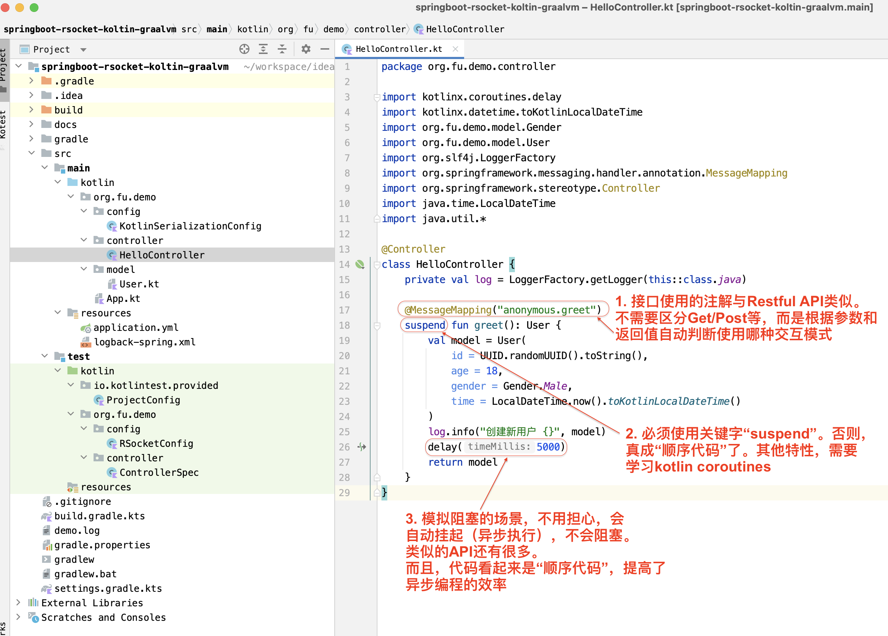
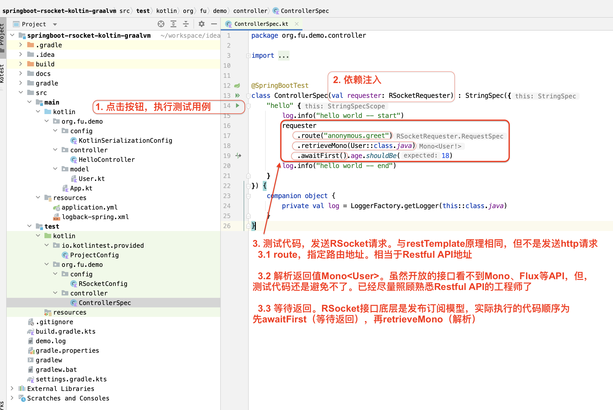

# 1 简介

示例项目`springboot-rsocket-koltin-graalvm`

- 学习如何使用gradle构建项目

- 学习如何充分利用kotlin的语法特性，提高开发效率

- 开放RSocket接口

- 测试RSocket接口

# 2 RSocket接口

> 如果使用Java开发，返回值是`Mono<User>`，且，Java语言不支持coroutines

# 3 测试

