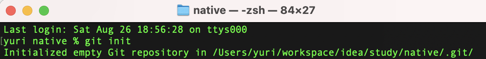

# 1 建立本地仓库

```
# 1 进入项目根目录
# 2 初始化
```



```
# 3 配置多个git账号。
将公司、个人学习、个人开源的项目，分别放在不同的仓库（github、gitee、gitlab、公司的私有仓库等）。
而，每个仓库都有不同的url、用户名、密码，所以，需要配置。
在全局配置中，去掉username和passaword。改为，在项目中单独配置。
这样不同的项目，就可以使用不同的username和password了，互不干扰。
## 3.1 查看全局配置，若选项与下面输出的内容不同，则需要修改
√~ % git config --global --list       
pull.rebase=true
core.autocrlf=input
init.defaultbranch=main

## 3.2 移除全局配置
git config --global --unset user.name
git config --global --unset user.email

## 3.3 修改默认分支名称为main
git config --global init.defaultbranch main

## 3.4 进入项目根目录，在项目中单独配置用户名，邮箱
git config user.name "xxx"
git config user.email "xxx@xx.xx"


# 4 将文件添加到本地仓库。`git add .`命令会根据`.gitignore`自动筛选
git add .

# 5 检查文件，确保没有遗漏
git status
```

# 2 关联github仓库

```
git remote add origin https://github.com/yuri-li/native.git
git branch -M main
git push -u origin main
```
