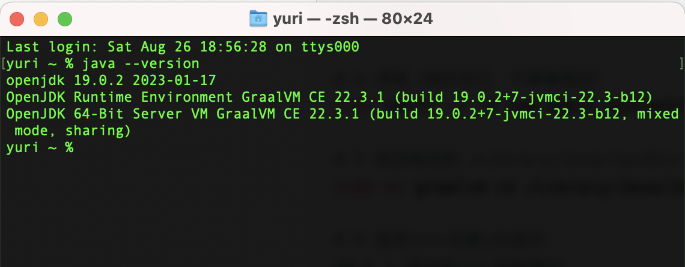
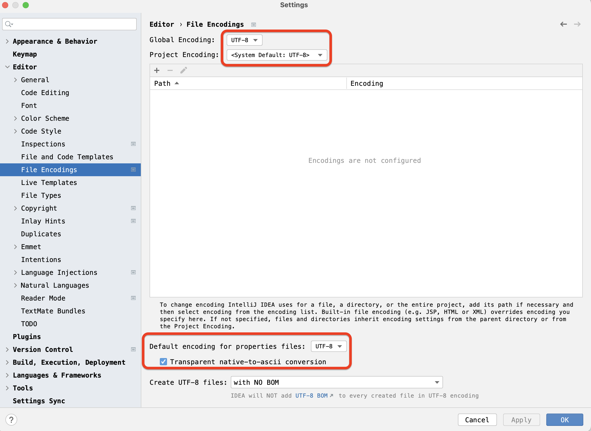

# 安装配置开发工具

软件的版本号非常重要，如果环境不一致，会遇到莫名其妙的BUG。同事也很难帮忙

| 名称            | 版本号                                                                           |
| ------------- | ----------------------------------------------------------------------------- |
| GraalVM       | [22.3.1](https://github.com/graalvm/graalvm-ce-builds/releases/tag/vm-22.3.1) |
| intellij idea | 2023.2.2                                                                      |
| kotlin        | 1.9.0                                                                         |
| git           | 2.41.0                                                                        |

# 1 管理多个版本的JDK

graalvm包含jdk

```
# 1 查看macos系统版本
case $(uname -m) in
    x86_64)  echo x86;;
    aarch64) echo arm;;
esac

# 2 下载对应版本的graalvm
https://github.com/graalvm/graalvm-ce-builds/releases/

# 3 加入下载目录，解压缩
tar -xzf graalvm-ce-java19-darwin-amd64-22.3.1.tar.gz

# 4 重命名为 graalvm-ce

# 5 清理（操作而已，不要管原因）
sudo xattr -r -d com.apple.quarantine /Users/yuri/tools/graalvm-ce

# 6 将其移动到 /Library/Java/JavaVirtualMachines
sudo mv graalvm-ce /Library/Java/JavaVirtualMachines

# 7 使用jenv设置jdk版本
## 7.1 添加到jenv的配置中
jenv add /Library/Java/JavaVirtualMachines/graalvm-ce/Contents/Home
## 7.2 查看当前可设置的所有版本
～ % jenv versions
  system
  17.0.2
* 19.0.2 (set by /Users/yuri/.jenv/version)
  graalvm64-19.0.2
## 7.3 设置默认jdk版本
jenv global graalvm64-19.0.2

# 8 设置Java Home
jenv enable-plugin export
exec $SHELL -l

# 9 检测jdk版本
```



```
# 9 设置intellij idea使用的jdk
## 9.1 进入设置页面
Cmd+Shift+A，输入 "Choose Boot Java Runtime for the IDE", press Enter
## 9.2 选择“/Library/Java/JavaVirtualMachines/graalvm-ce”
```

# 2 配置intellij idea

```
# 1 plugins。去除用不到的plugins，比如android,html,subversion,maven,tomcat等
# 2 Editor | File Encodings
```



```
# 3 Build, Execution, Deployment | Compiler | Kotlin Compiler
```


