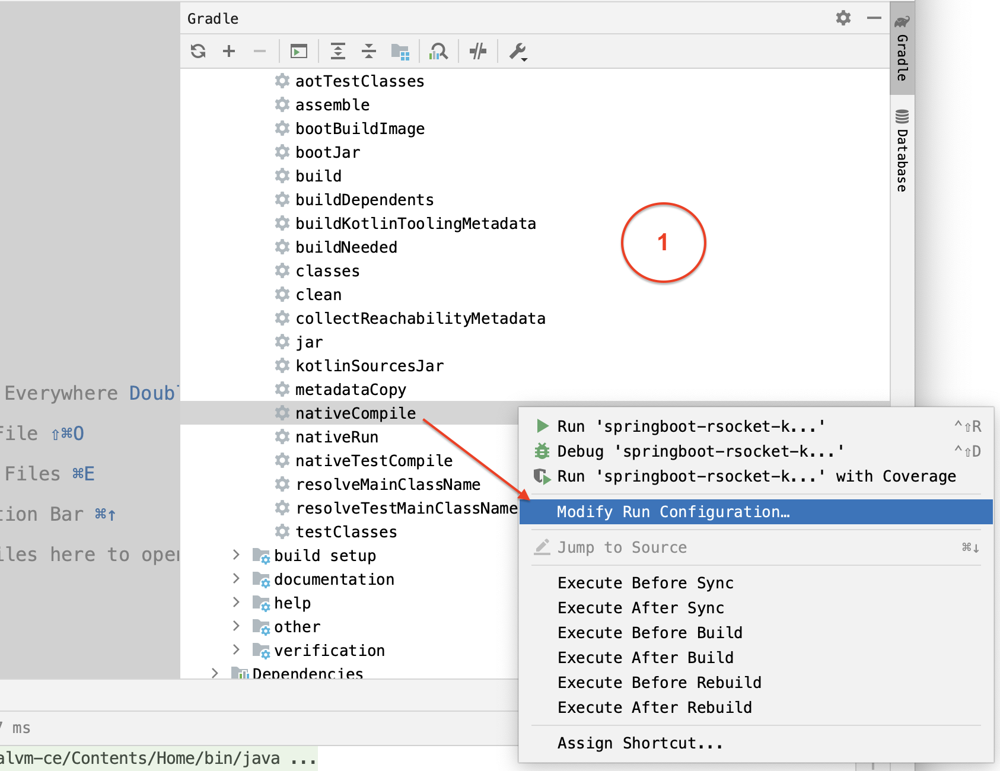
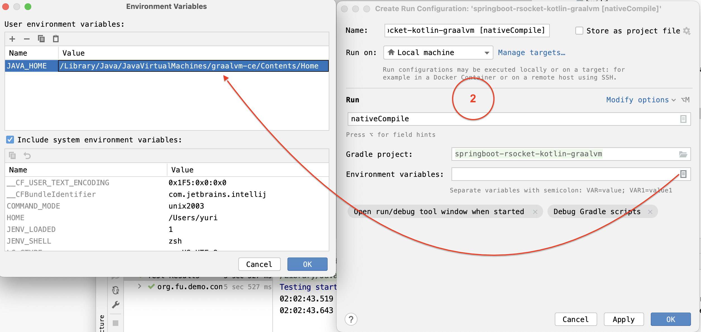
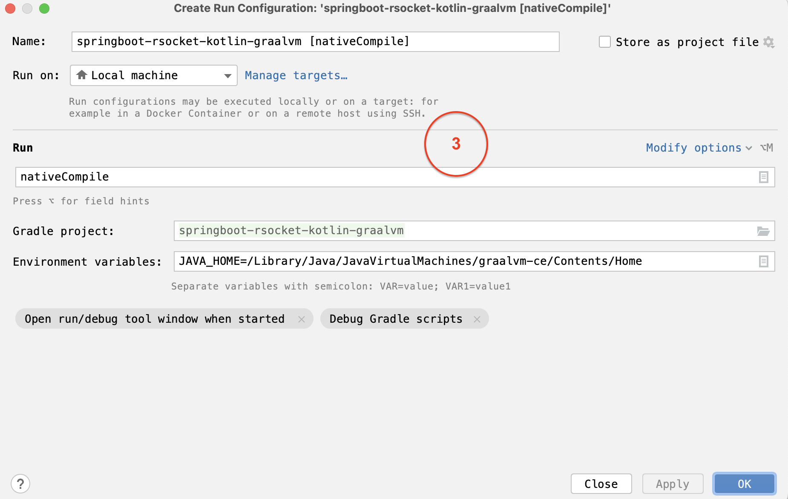
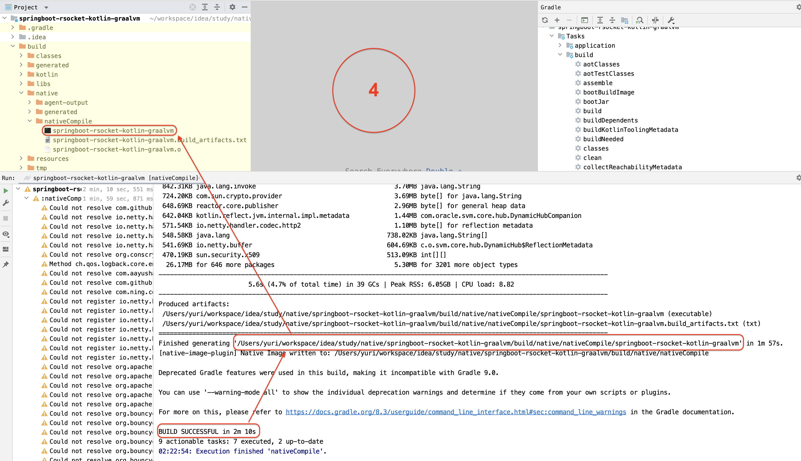
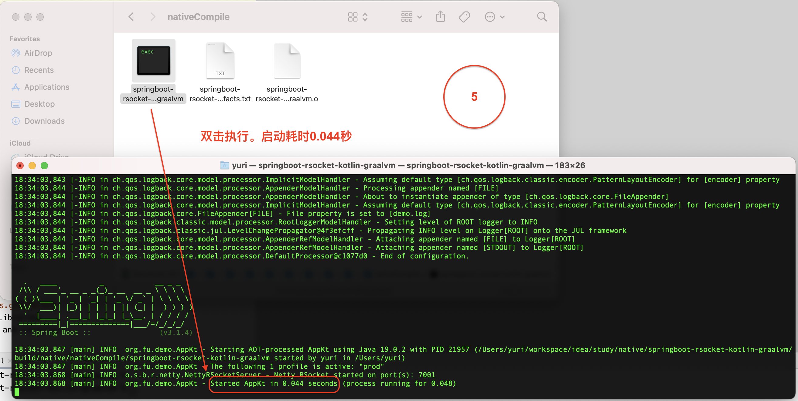
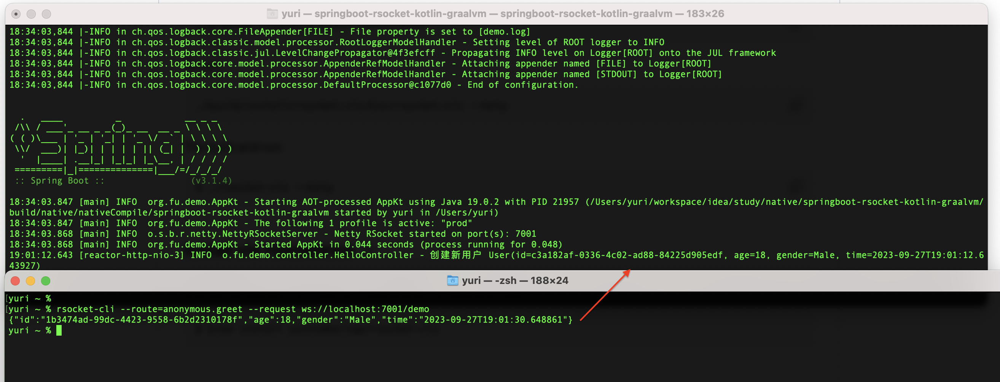

# 1 运行native程序

将springboot项目编译为本地可执行文件











# 2 测试

```
# 1 打开新的terminal，安装rsc。https://github.com/making/rsc
brew install making/tap/rsc

# 2 发送rsocket请求
rsc --request --route=anonymous.greet ws://localhost:7001/demo
```


