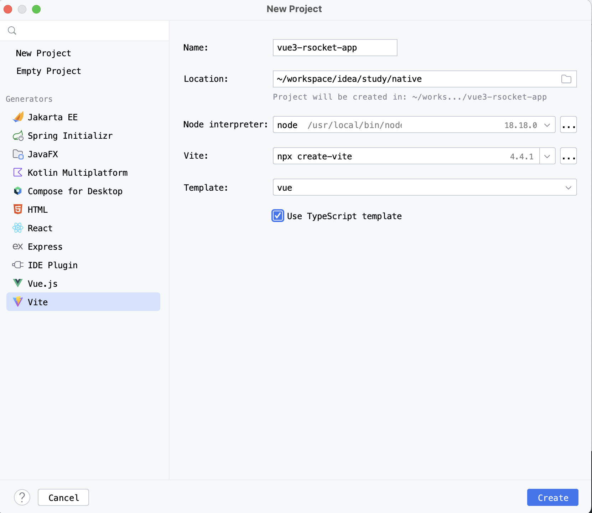

# 构建vue3开发环境

| 名称            | 版本号      |
| ------------- | -------- |
| intellij idea | 2023.2.2 |
| node.js       | v18.18.0 |
| npm           | 9.8.1    |
|               |          |
|               |          |

# 1 升级node.js

```
# 1 查看开发环境
$ npm --version
9.5.0
$ node --version
v18.15.0

# 2 升级
## 2.1 强制清理缓存
npm cache clean -f
## 2.2 全局安装nodejs
npm install -g n
## 2.3 启用stable版本
n stable

# 3 查看是否更新成功
$ npm --version
9.8.1
$ node --version
v18.18.0
```

# 2 全局安装create-vite

```
# 1 查看全局安装的包(清理多余的包)
yuri ~ % npm list -g --depth 0
/usr/local/lib
├── corepack@0.19.0
└── npm@9.8.1


# 2 全局安装create-vite
npm i -g create-vite
```

# 3 创建项目


