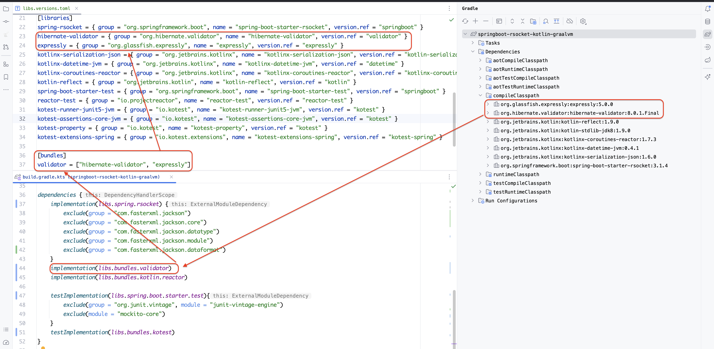

# 1 简介

`version catalog`，gradle的新功能。

`build.gradle.kts`，是kotlin脚本，包含项目构建的完整配置。但，运维人员很难看懂。

开发和运维的关注点不同。开发人员要构建完整的项目，而运维人员只关注`依赖、变量`，因为构建失败最大的可能性是版本号错了。

使用`version catalog`，运维人员要学习`toml`，才能完成项目构建、发布的工作。

# 2 如何使用

## 2.1 步骤

```bash
# 1 使用gradle 8.3+
# 2 启用intellij idea的toml插件
# 3 新建文件 `gradle/libs.versions.toml`
# 4 编辑 `gradle/libs.versions.toml`，且，在`build.gradle.kts`中使用
```

## 2.2 gradle/libs.versions.toml

| 名称        | 用途                   |
| --------- | -------------------- |
| versions  | 定义版本号                |
| plugins   | 定义plugins            |
| libraries | 定义dependencies       |
| bundles   | **组合多个dependencies** |

## 2.3 bundles示例



**1. build.gradle.kts**

```
dependencies {
    implementation(libs.bundles.validator)
}
```

**2. gradle/libs.versions.toml**

```toml
[versions]
validator = "8.0.1.Final"
expressly = "5.0.0"

[libraries]
hibernate-validator = { group = "org.hibernate.validator", name = "hibernate-validator", version.ref = "validator" }
expressly = { group = "org.glassfish.expressly", name = "expressly", version.ref = "expressly" }

[bundles]
validator = ["hibernate-validator", "expressly"]
```
