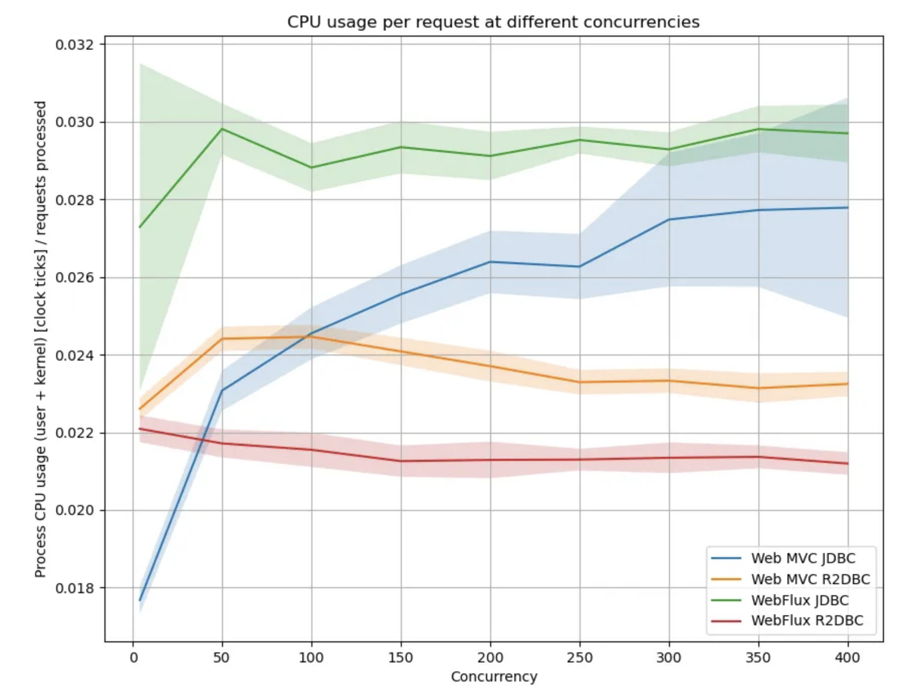
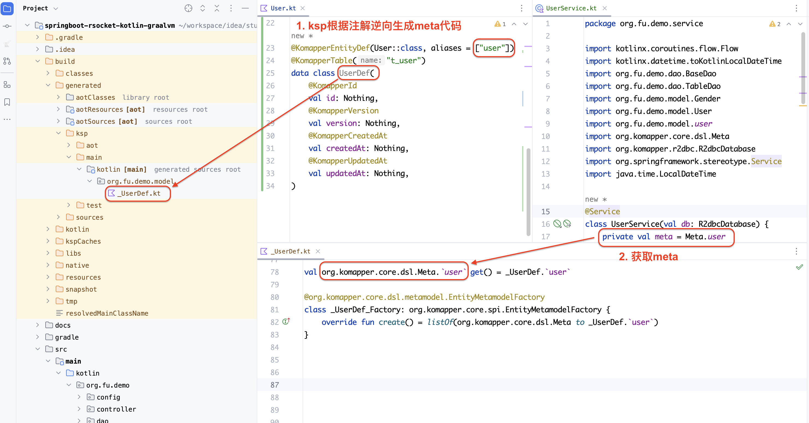

# 1 简介

使用`kotlin coroutines + r2dbc`，如何访问数据库？

# 2 思考

## 2.1 r2dbc

高并发查询时，r2dbc的性能很平稳



工程开发，性能不是第一要素，开发效率才是。`r2dbc`，其中`r`是`reactive`，即，响应式编程。这种编程范式很新鲜，起初，我也以为代码会很复杂。我不是正在做前后端的示例项目嘛，从结果看，代码量没有明显增加。而且，在高并发场景下，`kotlin coroutines`与`Reactive的架构/协议`都整合得很好，思路清晰，几乎没有开发难度。

## 2.2 为什么要写SQL？

在领域驱动设计之前，事实上的标准是`面向数据库开发`。在代码里，SQL只是普通的字符串，拼装SQL的代码不仅又臭又长，而且，修改字段，SQL不会报错！

但，分库分表、多表联合查询等场景，直接写SQL最高效。

# 3 komapper ORM框架

https://www.komapper.org/docs/overview/

- komapper将SQL语法转换为function

- 在entity上添加注解
  
  - 自动生成建表语句
  
  - 数据库表、字段等逆向生成代码，称为`meta`

SQL是function，参数是`meta`，都是代码。（与SQL语法类似）组合使用SQL function，实现复杂的查询、更新。

支持kotlin coroutines、r2dbc。轻松整合springboot。

> jOOQ、QueryDSL也支持SQL function呀，为什么不使用？
> 
> 答：不支持kotlin coroutines或r2dbc

# 4 如何使用komapper

## 4.1 komapper的Entity

```kotlin
import kotlinx.datetime.LocalDateTime
import kotlinx.serialization.Serializable
import org.komapper.annotation.*

@Serializable
data class User(
    val id: String,
    val age: Int,
    val gender: Gender,
    val time: LocalDateTime,
    val version: Int = 0,
    val createdAt: LocalDateTime? = null,
    val updatedAt: LocalDateTime? = null,
)

@Serializable
enum class Gender {
    Male, Female
}

@KomapperEntityDef(User::class, aliases = ["user"])
@KomapperTable("t_user")
data class UserDef(
    @KomapperId
    val id: Nothing,
    @KomapperVersion
    val version: Nothing,
    @KomapperCreatedAt
    val createdAt: Nothing,
    @KomapperUpdatedAt
    val updatedAt: Nothing,
)
```

其中，`UserDef`和`User`可以合并到一起，即，迁移对应的注解。建议初学者如示例所写，分开写，这样model和Entity的职责清晰。

> 序列化我没有使用`jackson json`，而是改为`kotlinx serialization`。

## 4.2 什么是meta

SQL语句中操作的表名称、字段名称等。



## 4.3 怎么使用meta访问数据库？

### 4.3.1 建表

```kotlin
import org.komapper.core.dsl.QueryDsl
import org.komapper.core.dsl.metamodel.EntityMetamodel
import org.komapper.r2dbc.R2dbcDatabase

object TableDao {
  suspend fun createTable(
      db: R2dbcDatabase, 
      vararg metamodels: EntityMetamodel<*, *, *>
  ) = db.runQuery { QueryDsl.create(metamodels.toList()) }
}
```

### 4.3.2 insert

```kotlin
import kotlinx.coroutines.flow.Flow
import org.komapper.core.dsl.QueryDsl
import org.komapper.core.dsl.expression.WhereDeclaration
import org.komapper.core.dsl.metamodel.EntityMetamodel
import org.komapper.core.dsl.query.first
import org.komapper.r2dbc.R2dbcDatabase

class BaseDao<ENTITY : Any, ID : Any, META : EntityMetamodel<ENTITY, ID, META>>(
    private val db: R2dbcDatabase,
    private val meta: META,
) {
   /**
    * insert into Table ([ Columns ]) values (?, ?, ?)
    */
    suspend fun save(entity: ENTITY) = db.runQuery {
        QueryDsl.insert(meta).single(entity)
    }

    /**
     * insert into Table ([ Columns ]) values (?, ?, ?), (?, ?, ?), (?, ?, ?)
     */
    suspend fun batchSave(list: List<ENTITY>) = db.runQuery { QueryDsl.insert(meta).multiple(list) }
)
```

> 思考，此处的Entity是哪个？`User, UserDef,_UserDef`？
> 
> 答：kotlin data class `User`

### 4.3.3 复杂SQL

与`QueryDsl`相同，略。

> `meta`包含表名称、字段名称

## 4.4 构建项目

`komapper`使用`google ksp`逆向生成`meta`。配置完成后，执行`gralde build`命令，会自动生成`meta`相关的代码

### 4.4.1 gradle/libs.versions.toml

```toml
[versions]
ksp = "1.9.0-1.0.13"
komapper = "1.14.1"

[plugins]
ksp = { id = "com.google.devtools.ksp", version.ref = "ksp" }


[libraries]
komapper-processor = {group = "org.komapper", name = "komapper-processor", version.ref = "komapper"}
komapper-spring-boot-starter-r2dbc = {group = "org.komapper", name = "komapper-spring-boot-starter-r2dbc", version.ref = "komapper"}
komapper-dialect-h2-r2dbc = {group = "org.komapper", name = "komapper-dialect-h2-r2dbc", version.ref = "komapper"}
```

### 4.4.2 build.gradle.kts

```kotlin
@file:Suppress("VulnerableLibrariesLocal")

import org.jetbrains.kotlin.gradle.tasks.KotlinCompile

plugins {
    ...
    alias(libs.plugins.ksp)
}
...
idea {
    module {
        isDownloadJavadoc = false
        isDownloadSources = true
        // Not using += due to https://github.com/gradle/gradle/issues/8749
        sourceDirs = sourceDirs + file("build/generated/ksp/main/kotlin") // or tasks["kspKotlin"].destination
        generatedSourceDirs = generatedSourceDirs + file("build/generated/ksp/main/kotlin") + file("build/generated/ksp/test/kotlin")
    }
}
dependencies {
    ...

    ksp(libs.komapper.processor)
    implementation(libs.komapper.spring.boot.starter.r2dbc)
    runtimeOnly(libs.komapper.dialect.h2.r2dbc)
}
```
