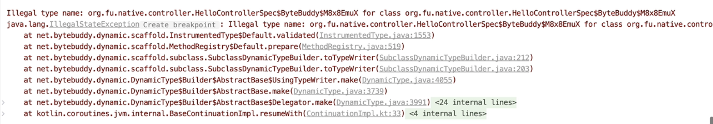
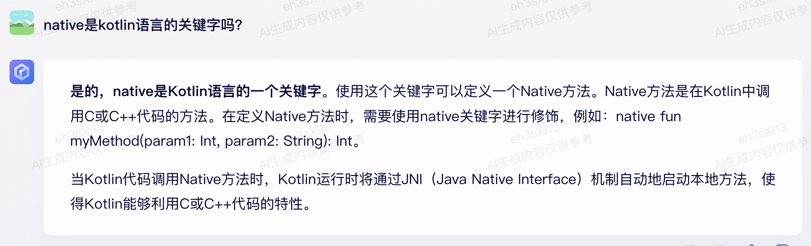
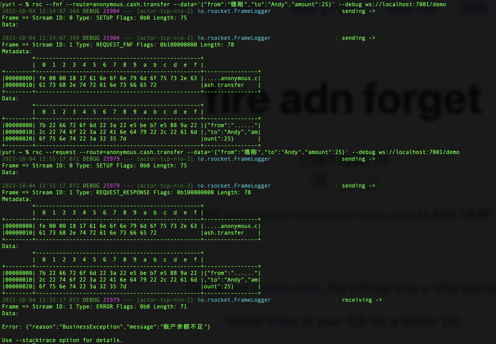

# 1 package name could not use "*.native.*"

## 1.1 场景描述

`package name` 如果包含 "native"关键字，则执行 "./gradlew :compileTestJava"会抛异常。

## 1.2 解决方案

换个名字就好了

# 2 fire and forget

## 2.1 场景描述

`fire and forget`，如果后台抛异常了，前端也拿不到响应

## 2.2 解决方案

后端接口不用改，前端发送请求时，使用“request-response”即可