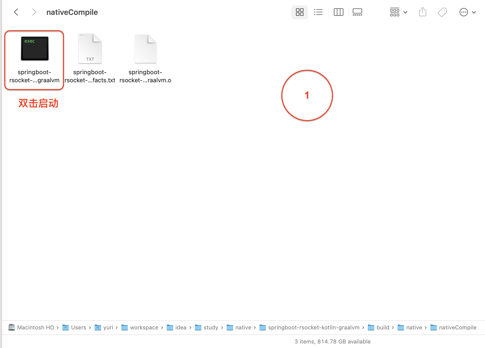
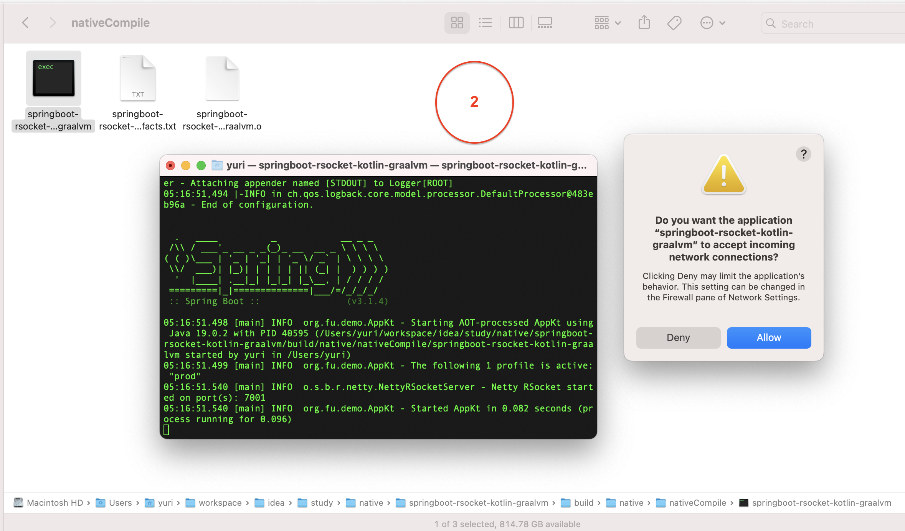
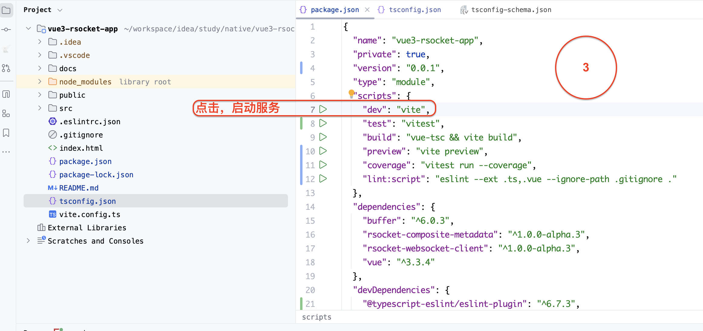
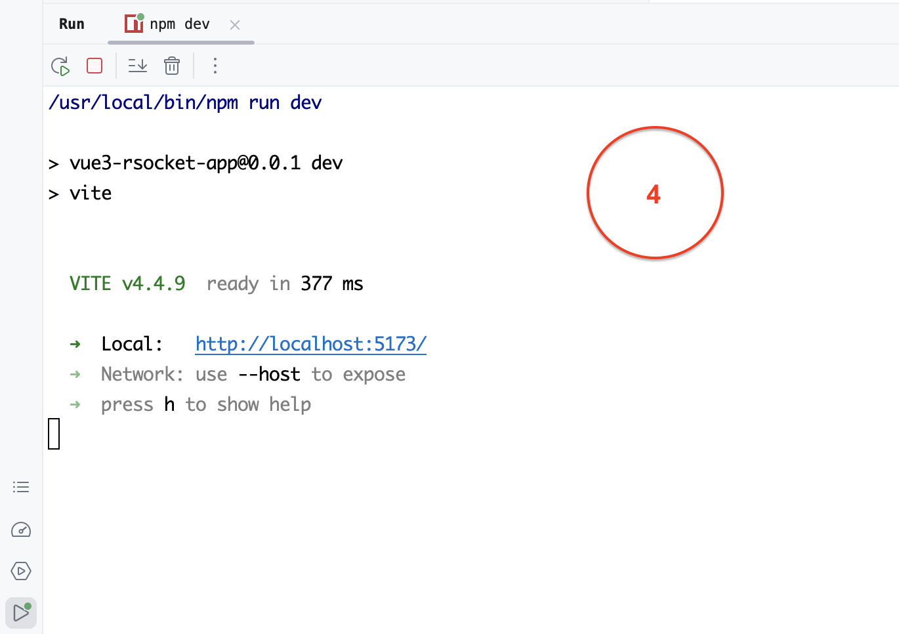
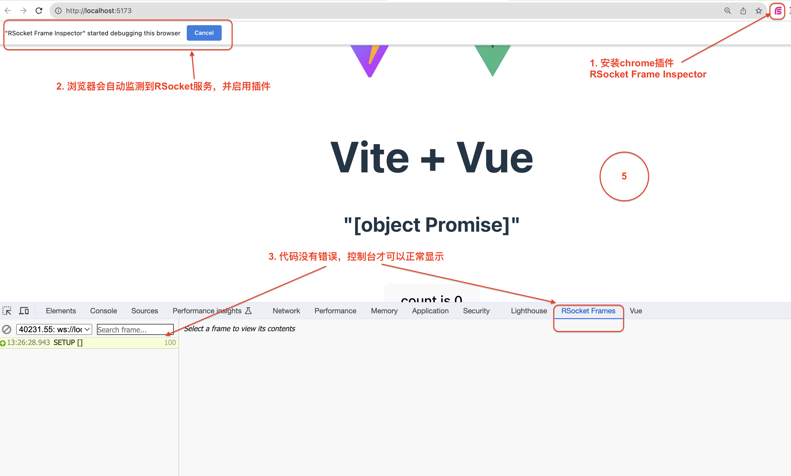

# 与后端建立链接

- 将后端服务编译为可执行文件

- 运行可执行文件。观察服务占用的内存、cpu

- 使用vue3+rsocket-js，与后端建立链接

# 1 构建项目

使用vite、vue-ts模板构建项目，过程，略

## 1.1 eslint

```
# 1 安装eslint
npm i --save-dev eslint eslint-plugin-vue @typescript-eslint/eslint-plugin @typescript-eslint/parser


# 2 .eslintrc.json
参数太多了...现在项目使用的配置文件优化过很多次了。建议，直接使用，遇到问题再修改
```

## 1.2 文件路径

- 使用`@`代替"/src"

- 使用`~`代替"/test"

因为相对路径、绝对路径在编译、运行的过程中很容易出错，所以，统一设置文件路径的规则

```
# 1 vite.config.ts
   resolve: {
        alias: {
            "@": resolve(__dirname, "src/"),
            "~": resolve(__dirname, "test/")
        }
    }

# 2 tsconfig.json
    "paths": {
      "@/*": ["src/*"],
      "~/*": ["test/*"]
    }
```

## 1.3 rsocket-websocket-client

```
npm i buffer rsocket-composite-metadata rsocket-websocket-client
```

# 2 src/config/api/rsocket.ts

```typescript
import { WellKnownMimeType } from "rsocket-composite-metadata"
import {WebsocketClientTransport} from "rsocket-websocket-client"
import {RSocketConnector} from "rsocket-core"
import {isEmpty} from "@/util/JsonExtension.ts"

class ServerOptions {
    protocol?: "ws"|"wss" = "ws"
    host?: string = "localhost"
    port: number | undefined
    mappingPath: string | undefined
}
function _buildServerOptions(_options: ServerOptions){
    const model = new ServerOptions()
    if(!isEmpty(_options.protocol)){
        model.protocol = _options.protocol
    }
    if(!isEmpty(_options.host)){
        model.host = _options.host
    }
    if(!isEmpty(_options.port)){
        model.port = _options.port
    }
    if(!isEmpty(_options.mappingPath)){
        model.mappingPath = _options.mappingPath
    }
    return model
}
async function createClient(_options: ServerOptions) {
    const setupOptions = {
        keepAlive: 120000,
        lifetime: 60000,
        dataMimeType: "application/json",
        metadataMimeType: WellKnownMimeType.MESSAGE_RSOCKET_COMPOSITE_METADATA.string,
    }
    const options = _buildServerOptions(_options)
    const transport = new WebsocketClientTransport({
        url: `${options.protocol}://${options.host}:${options.port}/${options.mappingPath}`,
        wsCreator: (url) => new WebSocket(url)
    })
    const client = new RSocketConnector({ setup: setupOptions, transport })
    return await client.connect()
}

export {createClient, }
```

# 3 HelloWorld.vue

直接在示例代码`HelloWorld.vue`中调用`createClient`

```typescript
import {createClient,} from "@/config/api/rsocket.ts"

const connector = createClient({
  port: 7001,
  mappingPath: "/demo",
})
```

# 4 测试

**1. 启动后端服务"springboot-rsocket-kotlin-graalvm"**





**2. 启动前端服务"vue3-rsocket-app"**





**3. 打开链接，查看浏览器后台是否报错**


