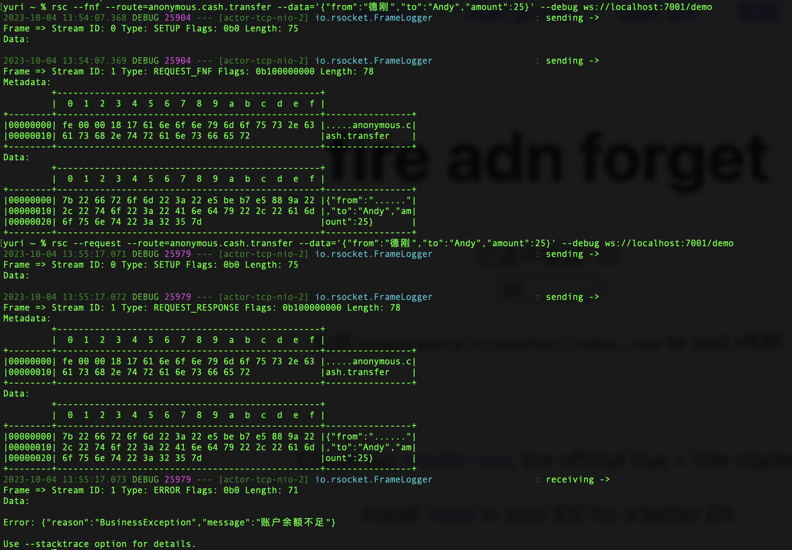

# 1 目的

- fire and forget，交互模式

- 接口添加参数，学习如何传参、解析等

- 故意抛出异常，前后端做全局异常处理

> `fire and forget`，接收不到后端抛的异常。只能改用`request-response`模式。

# 2 后端

## 2.1 接口

```kotlin
@Controller
class UserController: GlobalExceptionHandler() {
    private val log = LoggerFactory.getLogger(this::class.java)

    @MessageMapping("anonymous.cash.transfer")
    suspend fun transfer(dto: TransferDto) {
        if(dto.amount > 20){
            throw BusinessException("账户余额不足")
        }
        log.info("${dto.from}给${dto.to}转账${dto.amount}元")
    }
}
```

## 2.2 model

```kotlin
import kotlinx.serialization.Serializable

@Serializable
data class TransferDto(
    val from: String = "德刚",
    val to: String = "Andy",
    val amount: Int,
)
```

## 2.3 GlobalExceptionHandler

```kotlin
import io.rsocket.exceptions.CustomRSocketException
import org.slf4j.LoggerFactory
import org.springframework.messaging.handler.annotation.MessageExceptionHandler
//import javax.validation.ConstraintViolationException

open class GlobalExceptionHandler {
    /*@Throws(CustomRSocketException::class)
    @MessageExceptionHandler(ConstraintViolationException::class)
    fun handlerConstraintViolationException(ex: ConstraintViolationException) {
        val model = ex.constraintViolations.first()
        val temp = ValidationException(fieldName = model.propertyPath.toString(), message = model.message!!)
        log.error(temp.toString())
        throw temp.toRSocket()
    }*/

    @Throws(CustomRSocketException::class)
    @MessageExceptionHandler(BusinessException::class)
    fun handlerBusinessException(ex: BusinessException) {
        log.error(ex.toString())
        throw ex.toRSocket()
    }

    @Throws(CustomRSocketException::class)
    @MessageExceptionHandler(ErrorCodeException::class)
    fun handlerErrorCodeException(ex: ErrorCodeException) {
        log.error(ex.toString())
        throw ex.toRSocket()
    }

    @Throws(CustomRSocketException::class)
    @MessageExceptionHandler
    fun handlerUnknownException(ex: Throwable) {
        val temp = UnknownException(cause = ex)
        log.error(temp.toString())
        throw temp.toRSocket()
    }

    companion object {
        private val log = LoggerFactory.getLogger(this::class.java)
    }
}

enum class Reason(val errorCode: Int) {
    ValidationException(0x00000301),
    BusinessException(0x00000302),
    ErrorCodeException(0x00000303),
    UnknownException(0x00000304)
}

data class BusinessException(override val message: String) : RuntimeException(message) {
    override fun toString(): String = "${javaClass.name}: $message"
    fun toRSocket() = CustomRSocketException(
        Reason.BusinessException.errorCode,
        """{"reason":"${Reason.BusinessException}","message":"$message"}"""
    )
}

data class ErrorCodeException(val code: String, override val message: String) : RuntimeException(message) {
    override fun toString(): String = "${javaClass.name}: { code: $code -> message: $message }"
    fun toRSocket() = CustomRSocketException(
        Reason.ErrorCodeException.errorCode,
        """{"reason":"${Reason.ErrorCodeException}","code":"$code","message":"$message"}"""
    )
}

data class ValidationException(val fieldName: String, override val message: String) : RuntimeException(message) {
    override fun toString(): String = "${javaClass.name}: { code: $fieldName -> message: $message }"
    fun toRSocket() = CustomRSocketException(
        Reason.ValidationException.errorCode,
        """{"reason":"${Reason.ValidationException}","fieldName":"$fieldName","message":"$message"}"""
    )
}

data class UnknownException(override val cause: Throwable) : RuntimeException(cause) {
    override fun toString(): String = "${javaClass.name}: Unknown"
    fun toRSocket() = CustomRSocketException(
        Reason.UnknownException.errorCode,
        """{"reason":"${Reason.UnknownException}","message":"Unknown"}"""
    )
}
```

# 3 前端

```
<script setup lang="ts">
import {
  // fireAndForget,
  requestResponse
} from "@/config/api/rsocket"
import { TransferDto } from "@/components/transfer/model"
import { ref } from "vue"

const amount = ref()
async function changeItem(event: Event) {
  amount.value = parseInt((event.target as HTMLInputElement).value)
  // await fireAndForget("anonymous.cash.transfer", new TransferDto(amount.value))
  await requestResponse("anonymous.cash.transfer", new TransferDto(amount.value))
}
</script>
<template>
  <div class="card">
    <h1>fire adn forget</h1>
    <div>已选中金额: {{ amount }}</div>
    <select @change="changeItem">
      <option disabled value="">--请选择--</option>
      <option>15</option>
      <option>25</option>
    </select>
    <p>
      Edit <code>components/transfer/Index.vue</code> to test HMR
    </p>
  </div>
</template>
```

# 4 测试

`fire and forget`，接收不到后端抛的异常。只能改用`request-response`模式。

所以，要小心使用。确信前端发出请求后，不需要后端响应，才能使用`fire and forget`模式。


