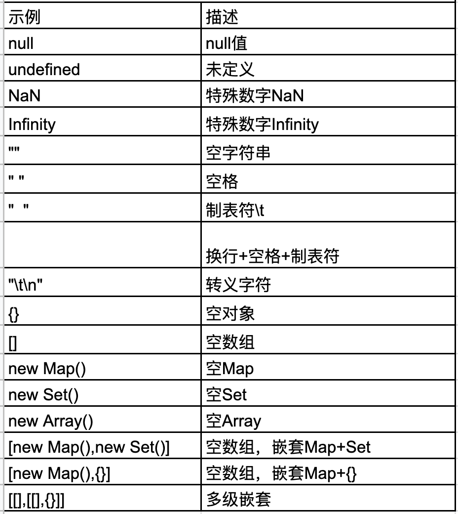
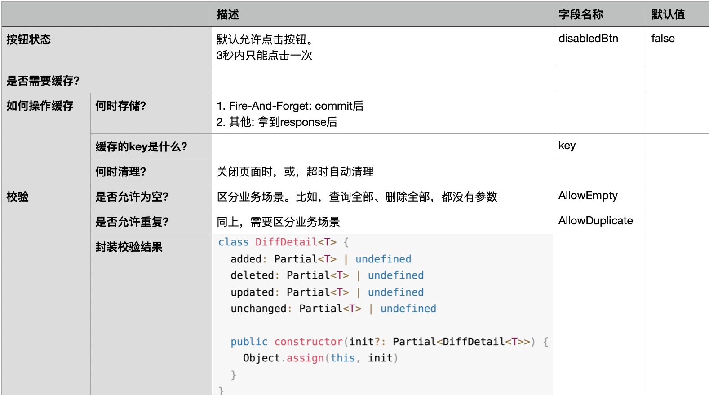
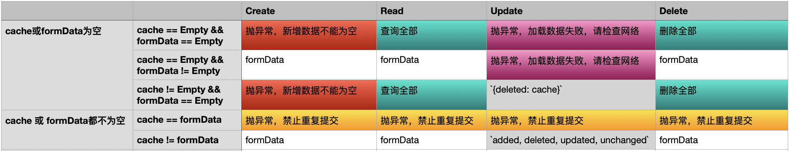

# 1 原则

- 用户**不应该连续提交**相同的数据
- 只提交用户**修改过**的数据

基于这两条原则，开发工具项目`rx-crud`

https://github.com/yuri-li/reactive-system/tree/main/vue3-demo/dev-tools/rx-crud/core

## 1.1 提取名词

缓存上一次提交的数据，做比对。比对结果`compare(cache, formData) = Empty 或 Duplicate`，即，用户没有修改数据，禁止提交。

| 类型      | 名称             |
| ------- | -------------- |
| 缓存      | cache          |
| 提交的表单数据 | formData       |
| 按钮状态    | disabledBtn    |
| 是否允许为空  | AllowEmpty     |
| 是否允许重复  | AllowDuplicate |

## 1.2 什么是Empty

相比后端语言，typescript的类型系统挺弱，不能满足业务需要。需要重新约定前后端交互时，什么是“空”！

> 自定义一个小型的编译器

# 2 规则

## 2.1 按钮状态

为了减少无效操作，3秒内，只能点击一次，即，“节流”。

**1. Create。若2秒内，提交数据，且，后端响应成功，可以解锁按钮吗？**

答：不可以。因为没有必要。

**2. Read。还有很多数据没显示，但，已超过3秒，解锁按钮吗？**

答：是的。因为用户可能想查看最新的数据，之前的操作就作废了。

**3. Fire-And-Forget，拿不到响应值，即，不关心是否成功，也要锁吗？**

答：是的。因为无效操作，本就没有意义

**4. 可以锁更长时间吗？比如，查询全部，平时响应速度就不快，需要让按钮锁久点**

答：可以

## 2.2 缓存

**1. Create。操作完毕，自动关闭页面，还需要缓存吗？**

答：不需要

**2. Read/Delete 全部，即，接口没有参数。缓存的key用什么？**

答：前端自己能区分就行了，比如，`view name`

## 2.3 校验

**1. Create。cache有ID，formData没有ID，怎么比较？**

答：model需要特别标记ID字段。比较cache与formData时，忽略ID

**2. 若允许重复查询，怎么做？**

答：分成两部分。框架负责抛异常。调用时，要捕获异常，让用户选择。所以，需要约定`Error code`

 
