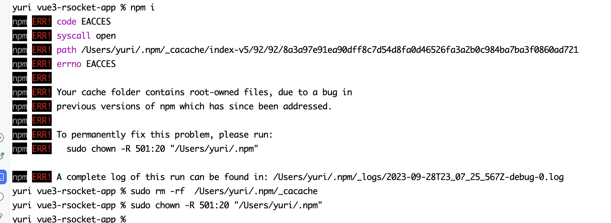

# 1 Permission denied when installing npm modules on macos

## 1.1 场景描述

执行命令`npm i XXX`报错，没有权限



## 1.2 解决方案

修改文件（夹）的权限

```
sudo chown -R $(whoami) $(npm config get prefix)/{lib/node_modules,bin,share}
```

# 2 Buffer is not defined

## 2.1 场景描述
`rsocket-js@1.0.0-alpha.3`只是添加了对typescript的支持，但，执行的标准是commonJs。这也是老项目的缺陷，包袱太重。找不到一些包很正常。

## 2.2 解决方案
```bash
# 1 安装依赖 buffer
npm i buffer

# 2 在index.html中添加下面的代码
<script type="module">
    import { Buffer } from "buffer"

    window.Buffer = Buffer
</script>
```
